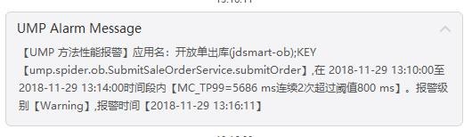
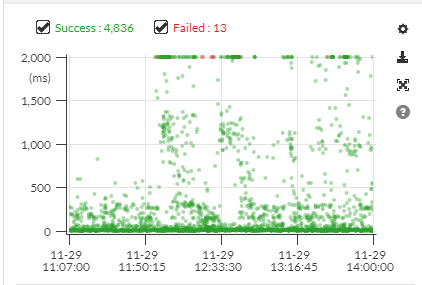
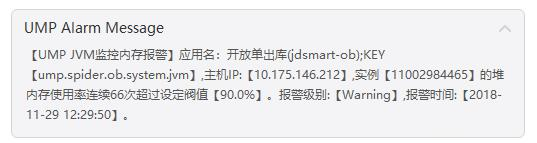
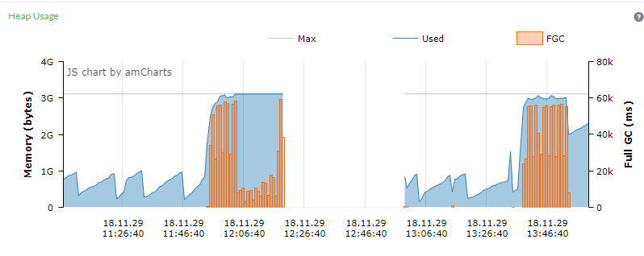
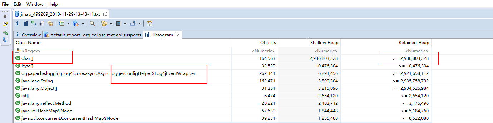
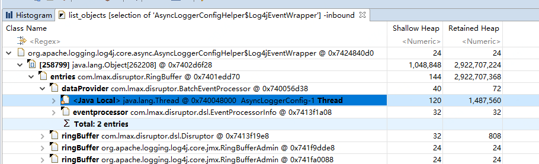
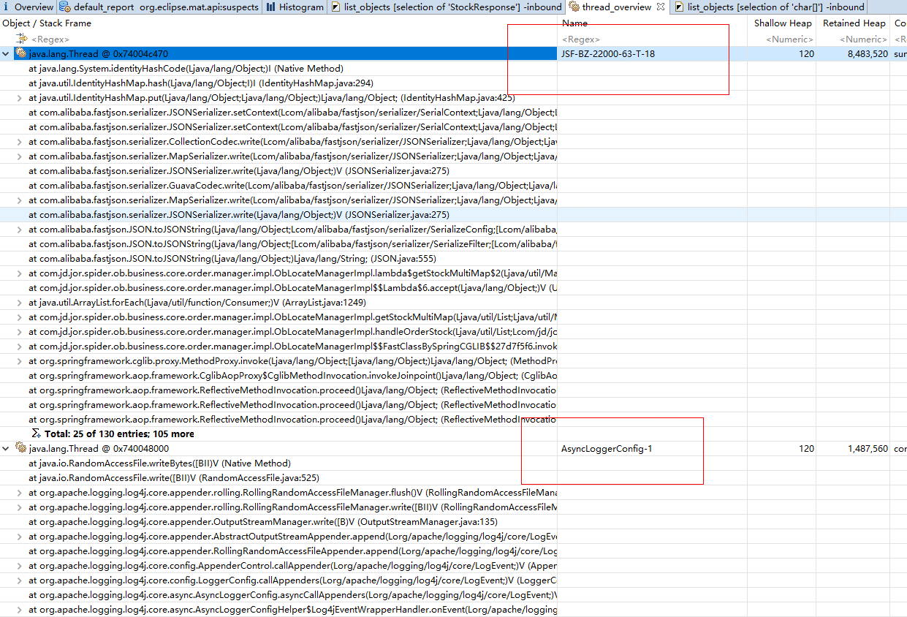
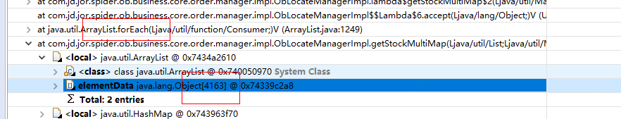
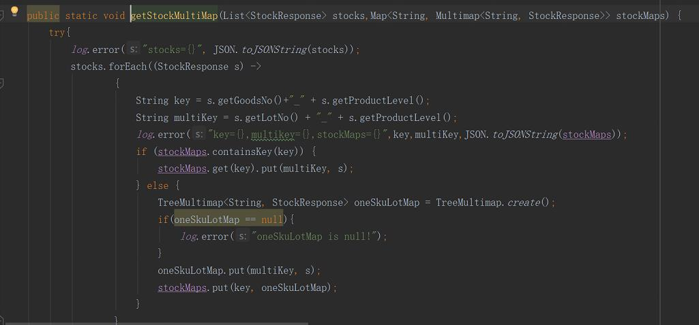
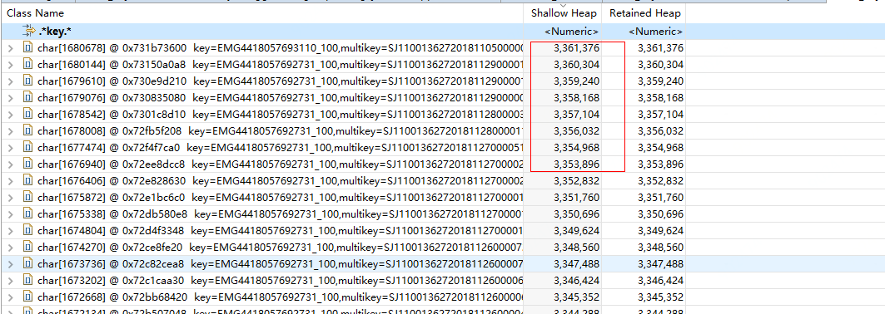

## jdsmart-ob内存报警问题分析

11月19中午开始，jdsmart-ob应用发生大面积报警，报警类型多数是TP99超时，通过JTrace也发现有很多查询慢的点

在一堆报警中还发现了一些系统报警，通过ump和JTrace可以看到系统内存已经达到了max，并且jvm一直在fullgc，因此推断大多数TP99超时是因为fullgc引起的，而引起fullgc的原因基本已经可以确定，是由于内存不够导致的，所以要分析一下内存为什么被打满。

dump下了内存文件进行了分析（使用的是eclipse的MAT）

发现log4jWapperEvent对象的RetainedHeap对象比较大，并且chat[]对象的Shallow Heap比较大，因此可以初步确定是因为打日志引起的内存不足的，需要进一步定位到在哪打出了这么多的日志

* Shallow Heap = 对象自身占用的内存大小，不包括它引用的对象

* Retained Heap = 当前对象大小+当前对象可直接或间接引用到的对象的大小总和

查看log4jWapperEvent对象的线程，发现是异步打logger的线程，不是真正打印日志的线程，所以异步有利也有弊呀~~~

通过查看所有线程栈发现，有一个线程的RetainedHeap对象也非常大，通过分析这个线程栈，可以确定就是此线程打印了很多日志

可以看到是一个foreach循环去打印日志，但是发现对象只有4000多个，为什么会产生这么多对象呢？

通过找到相关代码分析了一下，发现是for循环内部每次又去打印了一遍这4000多个对象组成的JSON String。

从dump文件中可以看到，4000多个对象转换成JSON Stirng大概是3M左右，然后循环4000多次，会产生12G的对象，而线上内存配置-Xmx3G，最终导致内存不够用。

至此已经找到了问题的所在，其实就是研发同学写代码的时候大意了，才导致这个线上问题。

**解决方案**：去掉这个打印这个日志的代码，因为这4000多个对象上面的方法已经做了打印日志。

后续在code review的时候需要加强日志方面的review，并且还要建立完整的日志规范，不要像上面代码似的，打日志还用error级别的。

