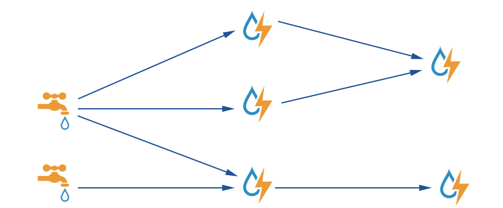
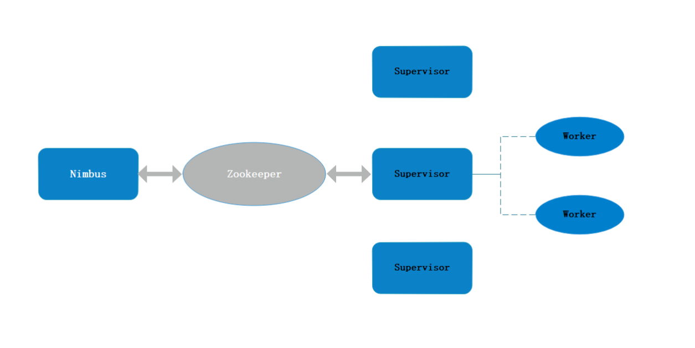
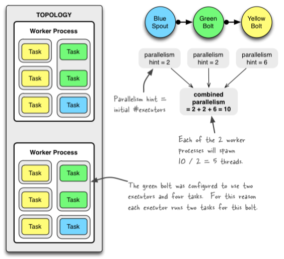
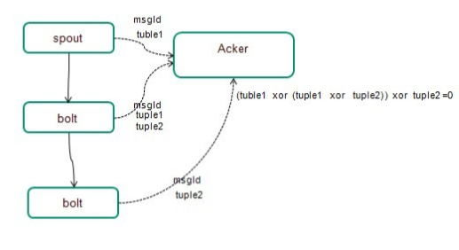

# Storm简介
  storm是非常优秀的分布式实时流式计算系统，满足了很多实时的计算需求，具有低延时的特点。
- storm是常驻内存的，不像Hadoop是不断启停了，所以没有启停的开销。
- storm数据是不经过磁盘的，在内存中处理，数据的交互经过网络，避免了IO的开销。

# Storm计算模型

# Storm组件
## Spout – 数据接入
数据产生的源头，可以接入KAFKA、MQ等各种来源。
``` java
static class SpoutDemo extends BaseRichSpout {

        private SpoutOutputCollector outputCollector;

        @Override
        public void open(Map map, TopologyContext topologyContext, SpoutOutputCollector spoutOutputCollector) {
            this.outputCollector = spoutOutputCollector;
        }

        @Override
        public void nextTuple() {
            System.out.println("产生消息...");
            outputCollector.emit(new Values(RandomUtils.nextInt(3), RandomUtils.nextInt(3)));
            try {
                Thread.sleep(200);
            } catch (InterruptedException e) {
                e.printStackTrace();
            }
        }

        @Override
        public void declareOutputFields(OutputFieldsDeclarer outputFieldsDeclarer) {
            outputFieldsDeclarer.declare(new Fields("pickup_code", "site_id"));
        }
    }
```
## Bolt - 数据处理
     
     接入spout的消息，处理具体业务逻辑，详见代码开发
   
## Stream Grouping -分组
-  shuffleGrouping 随机分发
-  localOrShuffleGrouping 查看本worker中是否存在
-  task实例，如果存在，则首先分发，否则同shuffleGrouping 
-  fieldsGrouping 按照某个字段hash
-  directGrouping 指定taskid
-  allGrouping 发给下游所有组件，相当于广播
-  customGrouping 自定义发送规则
-  noneGrouping 和shuflleGrouping类似

# Storm架构


## Nimbus

- 资源调度
- 任务分配
- 接收jar包

## Supervisor

- 接收nimbus分配的任务
- 启动、停止自己管理的worker进程（当前supervisor上worker数量由配置文件设定）

## Worker

- 运行具体处理运算组件的进程（每个Worker对应执行一个Topology的子集）
- worker任务类型，即spout任务、bolt任务两种
- 启动executor（executor即worker JVM进程中的一个java线程，一般默认每个executor负责执行一个task任务）

## Zookeeper

- Storm的所有的状态信息都是保存在Zookeeper里面，nimbus通过在zookeeper上面写状态信息来分配任务，
- supervisor，task通过从zookeeper中读状态来领取任务，同时supervisor, task也会定义发送心跳信息到zookeeper，使得nimbus可以监控整个storm集群的状态，从而可以重启一些挂掉的task。
- ZooKeeper使得整个storm集群十分的健壮，任何一台工作机器挂掉都没有关系，只要重启然后从zookeeper上面重新获取状态信息就可以了。

# Storm并行度

# Storm-ack


ack机制：相同为0，不同为1。acker巧妙的利用了xor的机制，只需要维护一个msgId的标记位即可，处理方法是acker在初始的时候，对每个msgId初始化一个校验值ack-val(为0)，
在处理完tuple和emit tuple的时候，会先对这两个个值做xor操作，生成的中间值再和acker中的当前校验值ack-val做xor生成新的ack-val值，当所有的tuple都处理完成都得到确认，
那么最后的ack-val自然就为0了

# 代码开发
## 抽象类(非合并)
``` java
public abstract class CommonProcessRichBolt extends BaseRichBolt {

    private static Logger LOG = LoggerFactory.getLogger(CommonProcessRichBolt.class);


    protected ConfigurableApplicationContext applicationContext;
    protected OutputCollector outputCollector;
    protected ElasticQueryDao elasticQueryDao;
    protected RedisLikeClient redisLikeClient;
    protected BulkRequestBuilder bulkRequestBuilder;
    protected List<Tuple> tupleList;
    protected CommonClient commonClient;
    protected EqualsByBaseSite equalsByBaseSite;
    protected String dbOperationType;
    protected IBaseSiteFromRedis baseSiteFromRedis;
    protected SubmitEs submitEs;

    public void prepare(Map map, TopologyContext topologyContext, OutputCollector outputCollector) {
        this.applicationContext = SpringContext.getSpringContext().getApplicationContext();
        this.outputCollector = outputCollector;
        this.elasticQueryDao = (ElasticQueryDao) applicationContext.getBean("elasticQueryDao");
        this.redisLikeClient = (RedisLikeClient) applicationContext.getBean("redisLikeClient");
        this.tupleList = new ArrayList<Tuple>();
        this.commonClient = (CommonClient) applicationContext.getBean("commonClient");
        this.equalsByBaseSite = (EqualsByBaseSite) applicationContext.getBean("equalsByBaseSite");
        this.baseSiteFromRedis = applicationContext.getBean(IBaseSiteFromRedis.class);
        this.bulkRequestBuilder = elasticQueryDao.getClient().prepareBulk();
        this.submitEs = new SubmitEs();
    }


    public void execute(Tuple tuple) {
        tupleList.add(tuple);
        String componentName = getComponentName();
        String registerInfo = componentName + ".execute";
        CallerInfo infoJk = Profiler.registerInfo(registerInfo, false, true);
        try {
            boolean isTickTupleFlag = isTickTuple(tuple);
            if (!isTickTupleFlag) {//处理非系统消息
                boolean flag = beforeCondition(tuple);
                if (flag) {//默认只消费insert和update消息
                    Map<String, Object> data = BusinessUtil.getResultMapByTuple(tuple);
                    handleMessageToRedis(data);
                    handlerMessageToEs(data);
                }
            }
            submitEs.submitEs(bulkRequestBuilder, outputCollector, tupleList, getTupleSize(), getBulkSize(), getSubmitEsTimeOut(), isTickTupleFlag);
        } catch (Exception e) {
            submitEs.fail(tupleList, outputCollector);
            LOG.error(componentName, e);
        } finally {
            Profiler.registerInfoEnd(infoJk);
        }
    }

    protected boolean beforeCondition(Tuple tuple) {
        dbOperationType = tuple.getStringByField(JDWRecordTranslator.OUTPUT_FIELD_OPERATION_TYPE);
        Boolean flag = DbOperation.parse(dbOperationType);
        if (!flag) {
            LOG.info("操作类型不是insert和update,operationType=" + dbOperationType);
        }
        return flag;
    }

    public boolean isTickTuple(Tuple tuple) {
        return tuple.getSourceComponent().equals(Constants.SYSTEM_COMPONENT_ID)
                && tuple.getSourceStreamId().equals(Constants.SYSTEM_TICK_STREAM_ID);
    }

    public Map<String, Object> getComponentConfiguration() {
        HashMap<String, Object> configMap = new HashMap<String, Object>();
        configMap.put(Config.TOPOLOGY_TICK_TUPLE_FREQ_SECS, 5);
        return configMap;
    }
 }
```
  
## 抽象类(合并)

``` java
public abstract class CommonMergeRichBolt extends BaseRichBolt {

  protected ConfigurableApplicationContext applicationContext;
    protected OutputCollector outputCollector;
    protected ElasticQueryDao elasticQueryDao;
    protected RedisLikeClient redisLikeClient;
    protected BulkRequestBuilder bulkRequestBuilder;
    protected List<Tuple> tupleList;
    protected CommonClient commonClient;
    protected EqualsByBaseSite equalsByBaseSite;
    protected String dbOperationType;
    protected IBaseSiteFromRedis baseSiteFromRedis;
    protected SubmitEs submitEs;

    public void prepare(Map map, TopologyContext topologyContext, OutputCollector outputCollector) {
        this.applicationContext = SpringContext.getSpringContext().getApplicationContext();
        this.outputCollector = outputCollector;
        this.elasticQueryDao = (ElasticQueryDao) applicationContext.getBean("elasticQueryDao");
        this.redisLikeClient = (RedisLikeClient) applicationContext.getBean("redisLikeClient");
        this.tupleList = new ArrayList<Tuple>();
        this.commonClient = (CommonClient) applicationContext.getBean("commonClient");
        this.equalsByBaseSite = (EqualsByBaseSite) applicationContext.getBean("equalsByBaseSite");
        this.baseSiteFromRedis = applicationContext.getBean(IBaseSiteFromRedis.class);
        this.bulkRequestBuilder = elasticQueryDao.getClient().prepareBulk();
        this.submitEs = new SubmitEs();
    }
    
    public void execute(Tuple tuple) {
        CallerInfo infoJk = Profiler.registerInfo(getComponentName().concat(".execute"), false, true);
        try {
            log.debug("source tuple= [{}] ", JSON.toJSONString(tuple));
            tupleList.add(tuple);
            Boolean flag = DbOperation.parse(dbOperationType);
            if (!flag) {
                log.info("操作类型不是insert和update,operationType=" + dbOperationType);
                submitEs.submitJsonBulk(jsonBuilderMap, tupleList, bulkRequestBuilder, outputCollector, elasticQueryDao);
                return;
            }
            Map<String, Object> data = BusinessUtil.getResultMapByTuple(tuple);
            handleMessageToRedis(data);
            handlerMessageToEs(data);
            submitEs.submitJsonBulk(jsonBuilderMap, tupleList, bulkRequestBuilder, outputCollector, elasticQueryDao);
            Profiler.registerInfoEnd(infoJkSubmit);
        } catch (Exception e) {
            Profiler.functionError(infoJk);
            log.error("[" + getComponentName() + "]异常！", e);
            for (Tuple tp : tupleList) {
                log.debug("call ack :" + tuple.toString());
                outputCollector.fail(tp);
            }
            tupleList.clear();
        } finally {
            Profiler.registerInfoEnd(infoJk);
        }
    }

    protected void addRecordToBulk(String docId, String index, String type, XContentBuilder jsonBuild) throws IOException {
        if (StringUtils.isBlank(docId) || StringUtils.isBlank(index) || StringUtils.isBlank(type) || jsonBuild == null) {
            return;
        }
        String mapKey = String.join(Constants.ApplicationConstants.CONCAT_KEY_PLACEHOLDER, docId, index, type);
        JSONObject preMessage = jsonBuilderMap.get(mapKey);
        //合并消息
        if (preMessage != null) {
            log.debug("=============== 开始合并消息 ===============");
            log.debug("合并前：{}", preMessage.toJSONString());
            //单Bolt内部消息有序，可以直接进行覆盖、替换操作
            JSONObject currMessage = JSONObject.parseObject(jsonBuild.endObject().string());
            Iterator<Map.Entry<String, Object>> iter = currMessage.entrySet().iterator();
            while (iter.hasNext()) {
                Map.Entry entry = iter.next();
                if (entry.getValue() != null
                        && !Objects.equals(entry.getValue(), preMessage.get(entry.getKey()))) {
                    preMessage.put(String.valueOf(entry.getKey()), entry.getValue());
                }
            }
            jsonBuilderMap.put(mapKey, preMessage);
            log.debug("合并后：{}", preMessage.toJSONString());
        } else {
            //追加时间戳
            jsonBuild.field(TS, System.currentTimeMillis());
            jsonBuilderMap.put(mapKey, JSONObject.parseObject(jsonBuild.endObject().string()));
        }
    }
}
```
## main方法
``` java
public class SenddSubmitter {
    private static Logger LOG = LoggerFactory.getLogger(SenddSubmitter.class);

    public static void main(String[] args) throws Exception {
        SubmitterUtil.checkArgs(args);

        TopologyBuilder builder = new TopologyBuilder();
        //send_d
        builder.setSpout(DMS_SEND_D_SPOUT, getSpout(SpoutSource.KeyWords.DMS_SEND_D, KafkaSpoutConfig.FirstPollOffsetStrategy.UNCOMMITTED_LATEST), getComponentNum(DMS_SEND_D_SPOUT));//设置spout数据来源以及spout的并发数量
        builder.setBolt(DMS_SEND_PROCESS_BOLT, new SendDetailProcessBolt(), getComponentNum(DMS_SEND_PROCESS_BOLT)).fieldsGrouping(DMS_SEND_D_SPOUT, new Fields(JDWRecordTranslator.OUTPUT_FIELD_PRIMARY_KEY));

        SubmitterUtil.submitTopology(args, builder);
    }
}
```

## 结合spring

   用插件maven-shade-plugin，否则项目中存在spring相关jar，打包的时候会把spring.handlers 和spring.schemas覆盖掉，导致xml解析失败
   
## ACK

- 每个bolt都需要调用ack方法，如果有某个没有调用，那么该消息不会执行成功
- Bolt如果向后面的组件发送，需要把当前组件添加到anchor中（emit(tuple,List)）

## 日志级别

    大数据平台现在的默认级别是warn，如果需要打印日志，需要自己在操作界面调整
    ROOT debug 10000

## 本地模式
``` java
    <dependency>
          <groupId>org.apache.storm</groupId>
          <artifactId>storm-core</artifactId>
          <version>0.9.6</version>
   </dependency>
```
## 线上模式 
``` java
   <dependency>
            <groupId>org.apache.storm</groupId>
            <artifactId>storm-core</artifactId>
            <version>1.0-bdp-SNAPSHOT</version>
   </dependency>
```
## pending大小和超时时间设置

   根据集群配置的消息量调整。但是最不好不要把pending设置的过大，同时超时时间设置的过小，资源处理不过   
   来的情况下会导致消息处理不完从而引发fail重试，会导致越来越多的消息重试。
   一般情况下配置pending的值为2000,超时时间设置为300
   

## 消息拆分
    
    对于消息量比较大的表，需要单独拆成一个拓扑结构，这样可以使得资源分配更加均匀，同时可以更加灵活的设置pending和超时时间。

## 消息合并
     
    对于需要合并的消息，比如路由消息，由于消息量比较大，如果根据运单号向外部设备，比如Elasticsearch去写入，当进行提交的时候，批量数据里面会有大量的docId重复的，此时可以对提交的消息进行
    合并操作，以减少消息写入量，减轻Elasticsearch的压力。

## 日志下载

    http://172.22.96.55/doctor-ui/

## 参数调整
- storm的参数调整，需要topic消息量大小，结合业务整体处理的性能和写入Elasticsearch的速度整体去考虑。

- 当业务整体处理的速度比较快，消息延迟比较小，可以适当的把pending调整的大一些，最好不要超过6000，timeout超时时间调整在300s左右比较合适，提交es的bulk大小调整在100~500左右。调整之后需要进行压测，看程序是否会出现崩溃，实际测试中pending调整的过大，风险会比较高。

- 当业务整体处理的速度比较慢，消息延迟比较大时，需要考虑代码的处理逻辑，看是否有优化的空间，同时调整pending的大小在1000-2000，提交es的bulk大小调整在50条以下。这样做的目的是使得消息快速的做ack确认。

- 以路由消息为例，因为消息量比较大，如果pending数比较大，提交es的bulk也比较大，会使得消息的处理延迟比较严重，大量的消息在等待被处理，超时之后出现失败，使得程序不能正常的处理新增的消息，而去处理失败的消息，进而出现程序不消费的现象，风险比较高。保险的做法是把pending调整在1000，bulk调整在10。但是这样带来的缺点是，频繁的提交es，可能会带来更多的版本冲突和拒绝请求，实际过程中需要具体观察。

- 当topic消息量比较小时，避免将提交es的bulk调整的过大，因为消息积攒不够bulk不会提交，会导致很多消息一直得不到ack确认，会出现bolt的负载比较小，但是消息消费的比较慢的情况。

- 不同的topic需要做适当的拓扑拆分，如果在一个拓扑里面，会导致bolt数过多，stormui无法查看，pending数无法针对消息具体控制。

## 消费性能
- 代码层面，观察代码的tp99，尽量控制在20ms以下，这样可以很大程度上减少程序崩溃的风险。

- 增加bolt的数量，以路由为例，10分钟的峰值在3000万左右，bolt的处理数至少应该设置在400个以上，才能处理过来。通过观察bolt的负载来调整bolt的数量，负载在0.8左右是比较理想的，超时1的时候就需要考虑增加bolt。

- 参数调整，topic消息量不太大的，可以适当调整pending的大小在3000~6000之间，同时调整提交bulk的大小在50以下，同时bolt数不能设置的太多，太多了导致消息会分散，消息积攒的太慢，延长提交es的速度; 消息量比较大的，像路由，pending设置在1000即可，bulk设置在20以下。Bolt可以适当增加数量，因为消息量大，不用担心消息积攒不够。
timeout超时参数，这个参数设置在300s即可。
             
- es集群，尽量申请数据节点多一些，太少了会出现reject的现象，导致消息一直写入不到es。


